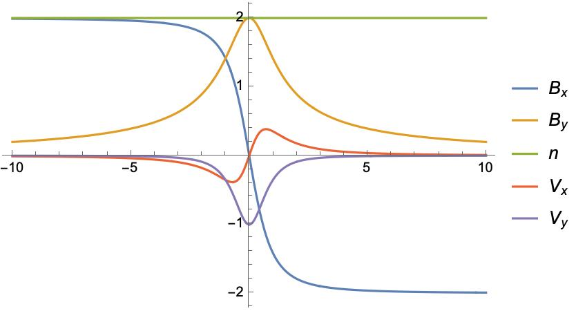

:::{.hide}
\newcommand{\vect}[1]{\mathbf{#1}}
:::

## Introduction

### Motivation

In MHD theory, for rotational rotational discontinuity, we have this following relationship

$$
[[\vec{U}]]=\left(\frac{\xi \rho}{\mu_0}\right)^{1 / 2}\left[\left[\frac{\vec{B}}{\rho}\right]\right]
$$

where $\xi \equiv 1-\frac{p_{\parallel}-p_{\perp}}{B^2 / \mu_0}$.

---

However, observations of solar wind discontinuities reveals discrepancies between

- Alfven velocity and plasma velocity change across discontinuities
- Anisotropic MHD theory-predicted and directly measured ion anisotropies

Multifluid theory is proposed to address these discrepancies. The basic idea is that we could have zero bulk velocity with non zero pressure.

#### MHD in a nutshell

$$
\begin{aligned}
& \frac{\partial \rho}{\partial t}+(\vec{V} \cdot \nabla) \rho+\rho \nabla \cdot \vec{V}=0 \\
& \rho\left[\frac{\partial \vec{V}}{\partial t}+(\vec{V} \cdot \nabla) \vec{V}\right]+\nabla p=\vec{J} \times \vec{B} \\
& p=\alpha \rho^\gamma \\
& \nabla \times \vec{B}=\mu_0 \vec{J} \\
& \frac{\partial \vec{B}}{\partial t}=\nabla \times(\vec{V} \times \vec{B})
\end{aligned}
$$

### Previous Work

On the extreme of multiple fluid theory, we have the kinetic Harris model for the current sheet.

- no normal field, $B_z = 0$
- uniform cross-tail drift velocity, $u_y$
- vanishing particle density far from the sheet

<!-- > Consider several deficiencies of the Harris model: (1) there is no normal field, Bz = 0, so that no particles cross the sheet from asymptotic sources; (2) the unrealistic assumption of uniform cross-tail drift velocity, uy; (3) vanishing particle density far from the sheet; (4) assumption of a simple Maxwellian velocity distribution; (5) further, one study showed that atypical current sheet structures with bifurcated current density occur 17% of the time, and even for typical center-peaked sheets, strongly peaked structures frequently appear in the center, which also differs from the Harris profile [Asano et al., 2005]. -->

@steinhauerMultifluidModelOnedimensional2008 built a multifluid model to study the steady state magnetotail current sheet.


---

For the symmetric three-fluid system with $B_y=0$, 


Here, we are interested in the case of a force-free current sheet and start from the simplest case of two ion species.


## Plasma-Field Equations for a One-Dimensional Multifluid

Consider a collisionless, steady state plasma composed of multiple fluid groups, and follow the notation in @steinhauerMultifluidModelOnedimensional2008, we have $3N$ equations for $N$ ion species:

$$
\begin{aligned}
Γ_α \frac{d u_{α x}}{d z} &= n_α u_{α y} B_z - Γ_α B_y
\\
Γ_α \frac{d u_{α y}}{d z} &= Γ_α B_x-n_α u_{α x} B_z
\\
Γ_α \frac{d u_{α z}}{d z} &= -\frac{1}{2} \frac{d p_α}{d z}-n_α \frac{d \phi}{d z}+n_α u_{α x} B_y-n_α u_{α y} B_x
\end{aligned}
$${#eq-momentum}

Ampere’s law connects the fields and the flow components and note that electron motion is along the field lines $\vect{u_e} = Γ_e \vect{B} / (n_e B_z)$ :

$$
d B_y / d z = - J_x = - \sum_α n_α u_{α x} + n_e u_{e x} = -n u_x+\Gamma_e B_x / B_z
$${#eq-Jx}

$$
d B_x / d z = J_y = \sum_α n_α u_{α y} - n_e u_{e y} = n u_y-\Gamma_e B_y / B_z
$${#eq-Jy}

---

This is a system of $3N+2$ equations for $4N+2$ unknown dependent variables: $B_x$, $B_y$, and $N$ each of $n$, $p$ $u_x$, and $u_y$.

- $B_z, Γ_α$ are constant.

- Combine momentum equation (x) (@eq-momentum) and Ampere's law (y) (@eq-Jy) with condition that the constant of integration vanishes at the current sheet center yield

  $$
  B_x B_z = \sum n_α u_{α,x} u_{α,z} = \sum Γ_α u_{α,x}
  $$

  - With asymptotic condition that the derivative goes zero, from momentum equation we have

    $$
    {B_z}^2 = \sum \Gamma_{\alpha}^2/n_{\alpha}(\infty)
    $${#eq-asym1}

In the following, we will consider a system with two ion species.

## Force-free current sheet

We are interested in solutions with $B_x^2 + B_y^2 = B_0^2 = const$ (force-free current sheet). This provides another equation for the system, now we have 3*2+2+1=9 equations for 10 unknowns (the system is close to be fully determined). From Ampere's law (@eq-Jx) and (@eq-Jy), we have:

$$
n (u_x B_y  - u_y B_x) = 0
$$

And $n_1 u_{1x} B_y = n_1 u_{1y} B_x + C_1$ and $n_2 u_{2x} B_y = n_2 u_{2y} B_x  - C_1$. Assuming $C_1 = 0$, from first two equations in (@eq-momentum), we have:

$$
u_{αx}^2 + u_{αy}^2 = const
$$

---

::: {#def-1}
Express the quantities of the second ion species relative to the first species

$$
u_{αx} := λ_{αx} u_{1x}, \quad u_{αy} := λ_{αy} u_{1y}, \quad u_{αz} := λ_{αz} u_{1z}, \quad n_α := λ_{αn} n_1
$$

$$
Λ_x := 1 + \sum λ_{αx} λ_{αn}, \quad Λ_y := 1 + \sum λ_{αy} λ_{αn}, \quad Λ_z := \sum 1 + λ_{αz} λ_{αn}
$$

Notes

- $Γ_e = (1 + λ_z λ_n) Λ_1 =  Λ_z  Γ_1$. 
- $Λ_z$ is constant while $Λ_x, Λ_y$ are not.

:::

::: {#def-2}
Force-free condition let us express the magnetic field and velocity in terms of the angle $θ$:

$$
B_x = B_0 \cos θ, \quad B_y = B_0 \sin θ
$$

$$
u_{1x} = u_{1} \cos θ_1, \quad u_{1y} = u_{1} \sin θ_1
$$
:::

---

$C_1=0$ immediately implies $θ = θ_1 + k \pi$ and $Λ_x=Λ_y$. #TODO: Prove $C_1=0$ is like a boundary condition not a equation.

The momentum equations (@eq-momentum) become:

$$
- u_1 \sin θ_1 θ_1' = n_1 u_1 \sin θ_1 B_z / Γ_1 - B_0 \sin θ
$$

$$
\Rightarrow 
θ' = - \frac{n_1 B_z}{Γ_1} \pm \frac{B_0}{u_1}
$${#eq-theta1}

- Note that $θ_1, n_1$ are dependent variables, and $u_1, B_0, B_z, Γ_1$ are constants determined by the system.
- **Given $n_1$, we could solve $θ_1$ from the above equation.**
- The derivative of $θ$ goes to zero at infinity, gives us a relation between $u_1$ and $B_0$:

  $$
  u_1 = \pm \frac{B_0 Γ_1}{B_z n_1(\infty)}
  $${#eq-u1}

The Ampere's law (@eq-Jy) become:

$$
- B_0 \sin θ θ' = Λ_y n_1 u_1 \sin θ_1 - Λ_z Γ_1 B_0 \sin θ / B_z
$$

$$
\Rightarrow 
θ' = \mp \frac{Λ_y n_1 u_1 }{B_0} + \frac{Λ_z Γ_1}{B_z}
$${#eq-theta}

By equating the above two equations, we could get a relation between $n_1$ and $Λ_y$:

$$
Λ_y = Λ_y(n_1) = -\frac{B_0 \left(-n_1 u_1 B_z^2+B_0 \Gamma _1 B_z-\Gamma _1^2 u_1 \Lambda _z\right)}{\Gamma _1 n_1 u_1^2 B_z}
$$

### Solutions

Normalize the density by $n_1(z=\infty) = 1$ and the magnetic field by $B_z = 1$.

The system $S$ could be fully determined by $λ_n, λ_z, B_0$ parameters, provided $n(z)$ profiles.

$$
S=S(z; n(z); λ_n, λ_z, B_0)
$$

Assuming density profile $n_1(z) \to \frac{c}{\left(\frac{z}{\delta }\right)^2+1}+1$

We have 

$$
\begin{aligned}
\varphi (z) &\to \frac{\pi  \Gamma _1-2 c \delta  \tan ^{-1}\left(\frac{z}{\delta }\right)}{2 \Gamma _1}
\\
B_x &\to B_0 \cos \left(\frac{\pi  \Gamma _1-2 c \delta  \tan ^{-1}\left(\frac{z}{\delta }\right)}{2 \Gamma _1}\right)
\end{aligned}
$$


For the simplest case $λ_n = 1, λ_z = - 1$, from @eq-asym1, we have $Γ_1 = - B_z / \sqrt{2}$.

We could also normalize the system length by $\delta = 1$. So now the system could be fully determined by $c, B_0$.

Given $c = 1/\sqrt{2}$, we have $B_y \to 0$ as $z \to \infty$. Profiles are plotted below for $B_0 = 2$.




The multi-fluid effect is clearly demonstrated by $Λ_y - 1$.

```mathematica
Manipulate[
 Block[{B0 = B0i, c = ci},
  p1 = Plot[
    Evaluate[{n[z], Bx[z], By[z], u1x[z], u1y[z]} /. sols //. rulesn],
    {z, -zmax, zmax},
    PlotLegends -> {n, Subscript[B, x], Subscript[B, y], Subscript[u, x], Subscript[u, y]}
  ];
  Export["figures/profiles.jpg", p1];
  p1
  ],
 
 {{ci, 1/Sqrt[2]}, 0, 2},
 {{B0i, 2}, 0.5, 2},
 {{zmax, 10}, 5, 30}
 ]

Manipulate[
 Block[{B0 = B0i, c = ci, Λz = Λz0},
  p = Plot[
    Evaluate[{Λy - 1, Jxi, Jx, Jyi, Jy} /. sols //. 
      rulesn],
    {z, -zmax, zmax},
    PlotLegends -> {Subscript[Λ, y] - 1, Subscript[J, 
      x, i], Subscript[J, x], Subscript[J, y, i], Subscript[J, y]}, 
    PlotRange -> All];
  Export["figures/J_profiles.jpg", p];
  p
  ],

 {{ci, 1/Sqrt[2]}, 0, 2},
 {{B0i, 2}, 0.5, 2},
 {Λz0, 0, 1},
 {{zmax, 10}, 5, 30}
]
```

For the same asymptotic magnetic field, it is interesting to see how the plasma profiles change with different system parameters.

$$
\text{cond}(n(z), λ_{n,∞}, λ_{z,∞}) = 0
$$

Here we set $B_y(z=\infty) = 1/2 B_y(z=0)$ and $B_0 = 2 B_z$, and fix $λ_{z,∞} = -1$. By varying $λ_{n,∞}$, we find that the magnetic field profiles are exactly the same, while plasma velocity profiles vary. We normalize the plasma velocity by asympotic Alfvén velocity $v_{A,∞} = B_0 / \sqrt{n}$, and the profiles are plotted below @fig-uxnorm. It could be seen that for $λ_{n,∞} = 1$, we have zero bulk velocity change across the current sheet in the asymptotic limit.


::: {.column-screen-inset}
::: {#fig-profiles layout-nrow="1" }

{#fig-profiles_ratio}

{#fig-uxnorm}

{#fig-uynorm}

:::
:::


## Different normalization

Normalized the quantities of the ion species

$$
n_α := λ_{αn} n_e
\\
u_{αx} := λ_{αu} B_z / \sqrt{n_{e,\infty}}
\\
u_{αy} := λ_{αu} B_z / \sqrt{n_{e,\infty}}
\\
u_{αz} := λ_{αu} B_z / \sqrt{n_{e,\infty}}
$$

$$
θ' = \mp \frac{Λ_u}{B_0} + Γ_e
$$


## References

- @steinhauerMultifluidModelOnedimensional2008

```mathematica
conf = {ratio -> 1/2}
TextString[conf]
<!-- Convert a dict-like configuration to a string -->
saveName[c_] := StringJoin[ToString /@ c]
```


